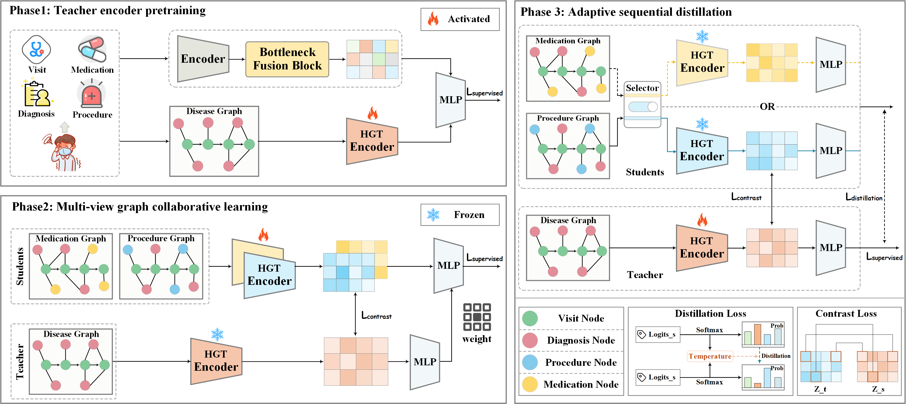

# PMVGD: A Progressive Multi-View Graph Distillation Paradigm for Health Event Prediction 

Official implementation of our paper:  
> **PMVGD: A Progressive Multi-View Graph Distillation Paradigm for Health Event Prediction**  
> *Information Fusion, 2026*  

---

## 🔥 Introduction  

To address the trade-off between noisy full-graph modeling and information loss in simplified graphs, we propose a **Progressive Multi-View Graph Distillation paradigm (PMVGD)** for health event prediction.  

Specifically, we construct multi-view graphs from EHR and adopt a progressive teacher–student learning process to integrate complementary clinical signals.

1. **Phase 1: Teacher Encoder Pretraining**  
    Pretrain the teacher on the disease graph to learn robust clinical patterns.

2. **Phase 2: Multi-View Graph Collaborative Learning**  
   Train student encoders on procedure and medication graphs under teacher guidance.

3. **Phase 3: Adaptive Sequential Distillation**  
   Distill multi-view knowledge back into the teacher for refined prediction.

Altogether, PMVGD converts distillation from a static, one-shot compression into an iterative cycle of mutual refinement.  

---
## 📊 Training Pipeline  

<p align="center">
  
</p>

---

## 🚀 How to Run (Phase 1)

You can pretrain the **teacher encoder** on MIMIC-III using: 
```bash
python -m experiments.run_phase1 \
  --dataset mimic3 \
  --model teacher \
  --epoch_main 130 \
  --mimic3_path "PATH/TO/mimic3/hosp"
```
You can pretrain the **teacher encoder** on MIMIC-IV using: 
```bash
python -m experiments.run_phase1 \
  --dataset mimic4 \
  --model teacher \
  --epoch_main 70 \
  --mimic3_path "PATH/TO/mimic4/hosp"
```

> *Default checkpoints will be saved in `./ckpt/phase1/`.*  

---

## 📂 Repository Structure  

```
PMVGD/
│── trainers/
│    ├── phase1_pretrain.py       # Phase 1 trainer
│    ├── phase2_collab.py         # (coming soon)
│    └── phase3_distill.py        # (coming soon)
│
│── experiments/
│    ├── run_phase1.py            # Phase 1 launcher
│    ├── run_phase2.py            # (coming soon)
│    ├── run_phase3.py            # (coming soon)
│    └── run_full.py              # (coming soon)
│
│── assets/
│    ├── pipeline.png             # training pipeline illustration
│    ├── modules.png              # model architecture illustration (optional)
│
│── models/                       # teacher & student encoders
│── data/                         # dataset preprocessing
│── utils/                        # dataloaders, configs, metrics
│── ckpt/                         # checkpoints (auto-generated)
│── README.md
```

---

## 📢 Release Plan  

- ✅ **Phase 1**: Teacher pretraining (released now)  
- 🔒 **Phase 2**: Multi-View Graph Collaborative Learning (to be released after acceptance)  
- 🔒 **Phase 3**: Adaptive Sequential Distillation (to be released after acceptance)  

---


