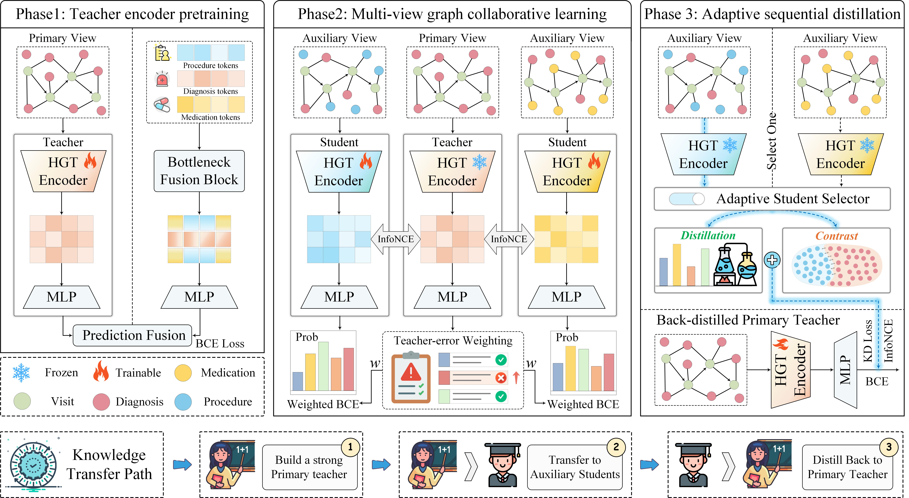

# PMVGD: Progressive Multi-View Graph Distillation for Health Event Prediction

Official implementation of **PMVGD: Progressive Multi-View Graph Distillation for Health Event Prediction**.

PMVGD learns from three complementary EHR graph views—disease, medication, and procedure—and transfers knowledge through a progressive teacher–student loop for next-visit diagnosis prediction.

---

## 🔐 Data Access

This study uses the MIMIC dataset hosted by PhysioNet. Due to PhysioNet's data access policy, we are not permitted to redistribute the dataset. Researchers can apply for authorized access through the official PhysioNet page:

[https://physionet.org/content/mimiciii/1.4/](https://physionet.org/content/mimiciii/1.4/)

---

## 🧭 Training Pipeline

<p align="center">
  
</p>

PMVGD is trained in three stages.

1. **Phase 1 — Teacher pretraining**

   Pretrain the teacher encoder on the disease graph.

2. **Phase 2 — Multi-view collaborative learning**

   Train medication and procedure student encoders under teacher guidance.

3. **Phase 3 — Back-distillation to the teacher**

   Distill student knowledge back to refine the teacher encoder.

---

## ⚙️ Environment

The codebase has been tested with:

- Python 3.10
- PyTorch 2.1.2
- PyTorch Geometric 2.3.1
- CUDA 12.6
- PyHealth 1.1.4

CUDA is recommended for graph-model training.

---

## 🚀 Training

Run commands from the repository root. The first Phase 1 run preprocesses the dataset and creates graph caches under `cache/<dataset>/`.

### Phase 1: teacher pretraining

MIMIC-III:

```bash
python -m experiments.run_phase1 \
  --dataset mimic3 \
  --model teacher \
  --epoch_main 130 \
  --mimic3_path "PATH/TO/mimic3/hosp"
```

MIMIC-IV:

```bash
python -m experiments.run_phase1 \
  --dataset mimic4 \
  --model teacher \
  --epoch_main 70 \
  --mimic4_path "PATH/TO/mimic4/hosp"
```

The best teacher checkpoint is saved to `ckpt/phase1/`.

### Phase 2: multi-view collaborative learning

Run Phase 2 after a Phase 1 checkpoint is available.

```bash
python -m experiments.run_phase2 \
  --dataset mimic3 \
  --model teacher \
  --epoch_view 20 \
  --mimic3_path "PATH/TO/mimic3/hosp"
```

MIMIC-IV:

```bash
python -m experiments.run_phase2 \
  --dataset mimic4 \
  --model teacher \
  --epoch_view 20 \
  --mimic4_path "PATH/TO/mimic4/hosp"
```

Phase 2 saves representation and prediction checkpoints to `ckpt/phase2/`.

### Phase 3: sequential back-distillation

Run Phase 3 after the Phase 1 and Phase 2 prediction checkpoints are available.

```bash
python -m experiments.run_phase3 \
  --dataset mimic3 \
  --model teacher \
  --epoch_kd 50 \
  --mimic3_path "PATH/TO/mimic3/hosp"
```

MIMIC-IV:

```bash
python -m experiments.run_phase3 \
  --dataset mimic4 \
  --model teacher \
  --epoch_kd 50 \
  --mimic4_path "PATH/TO/mimic4/hosp"
```

### Full pipeline

The following command runs Phase 1, Phase 2, and Phase 3 in sequence:

```bash
python -m experiments.run_full \
  --dataset mimic3 \
  --model teacher \
  --epoch_main 130 \
  --epoch_view 20 \
  --epoch_kd 50 \
  --mimic3_path "PATH/TO/mimic3/hosp"
```

MIMIC-IV:

```bash
python -m experiments.run_full \
  --dataset mimic4 \
  --model teacher \
  --epoch_main 70 \
  --epoch_view 20 \
  --epoch_kd 50 \
  --mimic4_path "PATH/TO/mimic4/hosp"
```

Use the individual phase commands when resuming from an existing checkpoint, so completed phases are not trained again.

---

## 📁 Repository Structure

```text
PMVGD/
├── assets/
│   └── pipeline.jpg                 # Training pipeline illustration
├── data/
│   ├── dataset.py                   # MIMIC task definitions
│   ├── subgraph_builder.py          # Multi-view graph construction
│   └── splits.py                    # Reproducible patient splits
├── experiments/
│   ├── run_phase1.py                # Teacher pretraining launcher
│   ├── run_phase2.py                # Multi-view learning launcher
│   ├── run_phase3.py                # Back-distillation launcher
│   └── run_full.py                  # Full pipeline launcher
├── models/
│   ├── encoder/                     # Teacher and student encoders
│   ├── bottleneck/                  # Heterogeneous bottleneck fusion
│   ├── layers/                      # Graph and sequence layers
│   └── loss/                        # Contrastive loss
├── trainers/
│   ├── phase1_pretrain.py
│   ├── phase2_collab.py
│   └── phase3_distill.py
├── utils/                            # Dataloading, metrics, and training helpers
├── cache/                            # Generated graph caches
├── ckpt/                             # Generated checkpoints and selection logs
└── README.md
```

---
